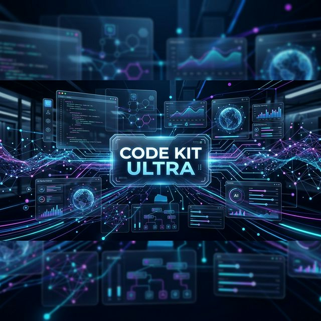
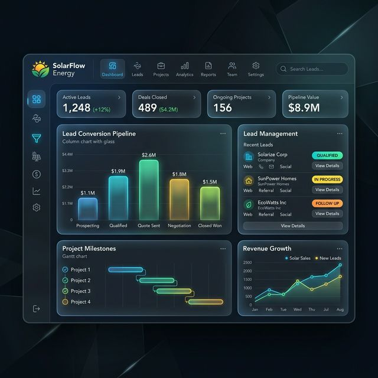
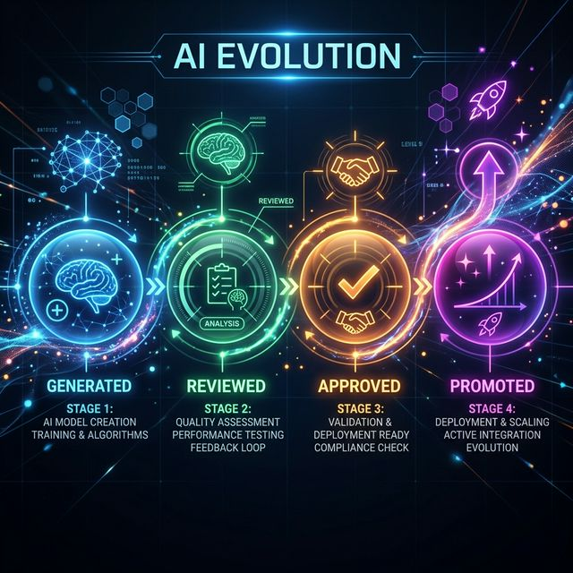

# Code Kit Ultra: The Governed AI Operating System for Product Delivery 🚀



**From Idea to Production-Ready, Governed, and Scalable in Minutes.**

---

[](https://github.com/eybersjp/Code-Kit-Ultra)
[](https://opensource.org/licenses/MIT)
[](https://github.com/eybersjp/Code-Kit-Ultra/actions)

---

## ⚠️ Current State

Code Kit Ultra provides a **fully governed execution framework**.

Agent intelligence (LLM-driven generation) is:

- partially implemented
- evolving rapidly

The system guarantees:

- safe execution
- auditability
- reproducibility

But does not yet guarantee:

- production-perfect code generation.

---

## ⚡ Why Code Kit Ultra?

Most AI tools stop at "Hello World." **Code Kit Ultra** takes you to "Prime Time." It is a governed, multi-agent AI execution system designed to turn complex product ideas into production-grade solutions. It provides a secure, auditable workspace where AI agents perform real work under human oversight.

### Top 3 Use Cases

1. **[SaaS Rapid Prototyping](docs/CASE_STUDY_SIMPLE_CRM.md)**: Build a governed CRM or Internal Tool schema in 60 seconds.
   

2. **[Enterprise Ops Automation](docs/CASE_STUDY_INTERNAL_TOOL.md)**: Orchestrate complex workflows across disparate systems.
   

3. **[Self-Extending Skill Ecosystem](docs/CASE_STUDY_SKILL_LIFECYCLE.md)**: Generate, review, and promote AI skills.
   

---

## 🚀 Get Started in 2 Minutes

### 1. The Governed Health Check

Ensure your environment is ready for excellence.

```bash
# Site health check
npm run ck -- /ck-doctor
```

### 2. Witness Your Governed Execution

Execute a preview-and-queue flow to see how Code Kit Ultra handles risk.

```bash
# Run with preview mode
npm run ck -- /ck-run "Demo project" --mode expert
```

### 3. Build Your Idea

Initialize your first project with namespaced command orchestration.

```bash
npm run ck -- /ck-init "Build a field-service CRM for solar installers"
```

---

## 📖 Canonical Flows

To prevent command explosion from overwhelming your workflow, use these two primary flows:

### ⚡ Quick Mode (Turbo)

*Use for simple tasks where you trust the execution.*

```bash
/ck-mode turbo
/ck-init "Build X"
/ck-run
```

### 🧠 Controlled Mode (Builder/Pro)

*Use for complex builds requiring line-level audit.*

```bash
/ck-mode builder
/ck-init "Build X"
/ck-run
/ck-preview
/ck-approve-batch <id>
/ck-run
```

---

## Installation

### From Local Source

```bash
# Register the local folder as a package
pnpm add -g . 
```

### From GitHub (Recommended)

You can install `codekit` directly from the repository without cloning:

```bash
# Global install via pnpm
pnpm add -g git+https://github.com/eybersjp/Code-Kit-Ultra.git#main

# Global install via npm
npm install -g git+https://github.com/eybersjp/Code-Kit-Ultra.git#main
```

After installation, you can run the CLI using the `codekit` command with namespaced protocol.

```bash
codekit /ck-init "I need a micro-service for fleet monitoring"
codekit /ck-run
```

## Features

- **Deterministic Core**: Rule-based intake and planning.
- **Governed Progress**: Automated quality gates.
- **Multi-Adapter Support**: Strategic routing for AI agents.
- **Rollback Safety**: Instant recovery if a promoted skill fails validation.

---

## 📸 Proof of Excellence

> [!TIP]
> **Check out the [Visual Showcase](docs/DEMO_SCRIPT.md)** to see Code Kit Ultra in action with real screenshots and walk-throughs.

- **Unified Control Plane**: Planning via Antigravity, Implementation via Cursor.
- **Governed Promotion**: No skill reaches production without an audit trail.

---

## 📈 Traction & Roadmap

| Feature | Status | Milestone |
| :--- | :--- | :--- |
| **Command Protocol (/ck-*)** | ✅ Live | v1.1.0 |
| **Governed Autonomy Modes** | ✅ Live | v1.1.0 |
| **Operational Stack (.ck/)** | ✅ Live | v1.1.0 |
| **Trust & Audit Layer (Phase 2)** | 🏗️ Active | v1.1.1 |
| **Governed Execution Layer** | 🏗️ Active | v1.2.0 |
| **Multi-Agent Parallelism** | 📅 Q1 2027 | v2.0.0 |

---

## 🤝 Join the Community

- **[CONTRIBUTING.md](CONTRIBUTING.md)**: Help us build the future of AI delivery.
- **[USER_FEEDBACK_LOG.md](docs/USER_FEEDBACK_LOG.md)**: See what others are saying and add your voice.
- **[SUPPORT.md](SUPPORT.md)**: Get help from the core team.

---

*Code Kit Ultra: Not just technically impressive—organization-ready.*

