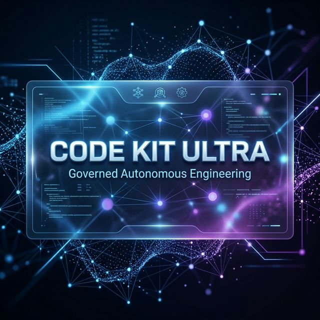
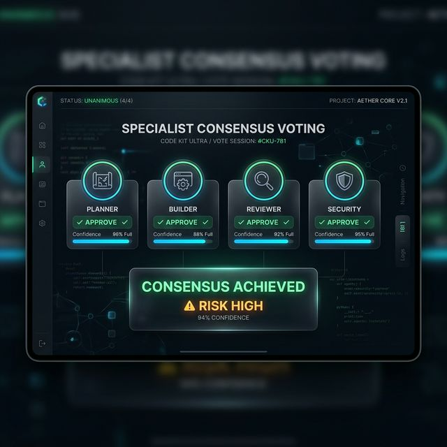
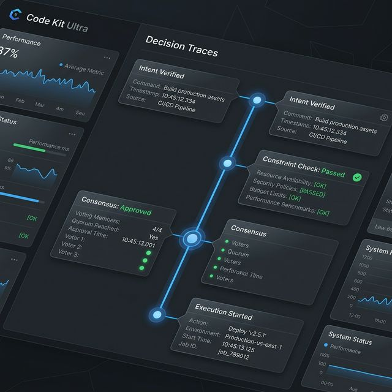

# Code Kit Ultra

## v1.1.1-trust-ultra

### The Governed Autonomous Engineering System

Code Kit Ultra is a next-generation platform that transforms software development from manual coding into a **self-governing, explainable, and continuously improving autonomous system**.

Unlike traditional AI coding tools that focus only on code generation, Code Kit Ultra prioritizes **auditable execution, safety, and learning**.

---

## 🧠 How It Works: The Full Autonomous Loop

1. **Idea Intake**: Understand intent and surface assumptions.
2. **Strategic Planning**: Decompose ideas into a deterministic task graph.
3. **Governed Evaluation**: Multi-layer safety check (Intent, Constraints, Validation).
4. **Specialist Voting**: Agents (**Planner, Builder, Reviewer, Security**) evaluate risky batches.
5. **Adaptive Consensus**: Risk-weighted decisioning with **Veto Authority** for security risks.
6. **Execute / Block**: Signed execution with atomic backups, or block on risk.
7. **Observability**: Full decision traces, event timelines, and audit reports saved to `.ck/`.
8. **Outcome Feedback**: Record real-world success/failure for each run.
9. **Self-Tuning Learning**: Adjust agent reliability and governance thresholds automatically.
10. **Loop Evolution**: Future decisions become more accurate and safer over time.

---

## 🔥 Core Capabilities

### 🛡️ Governed Execution

Code Kit Ultra enforces a "think-before-acting" boundary. No action is performed unless it aligns with user intent and passes strict safety policy checks.

### 👁️ Full Observability & Explainability

Every autonomous decision is visible. The system generates:

- **Decision Traces**: Why exactly an action was approved or blocked.
- **Audit Reports**: Markdown/JSON summaries of every run.
- **Score Breakdown**: Explanations for confidence scores and risk assessments.

### ⚖️ Adaptive Specialist Governance

Decisions are not made by a single model. A specialist-driven consensus engine (Planner, Builder, Reviewer, Security) simulates expert reasoning and adapts thresholds based on the risk level (Low, Medium, High).

### 🔁 Self-Tuning Learning

The system improves itself. It learns from execution outcomes, evolving agent reliability profiles and adjusting governance policies to manage risk more effectively in the future.

---

## ⚙️ CLI Command Protocol (`/ck-*`)

### 🛡️ Governance & Security

- `/ck-validate <json>`: Validate action batch structural integrity.
- `/ck-constraints <json>`: Define and enforce safety policies.
- `/ck-killswitch <json>`: Immediate safety evaluation of a batch.
- `/ck-score <json>`: Score execution confidence.

### 👁️ Observability

- `/ck-trace <runId>`: Full governance trace for a specific execution.
- `/ck-timeline <runId>`: Sequencing of events for a run.
- `/ck-report <runId>`: Generate Markdown execution report.
- `/ck-score-explain <runId>`: Explain the confidence score breakdown.

### 🧠 Adaptive Consensus

- `/ck-consensus-sim <json>`: Simulate specialist voting for any batch.
- `/ck-consensus-adaptive`: Compute live adaptive consensus.
- `/ck-agent-profile`: View/manage specialist agent reliability and weights.

### 🔁 Learning & Evolution

- `/ck-outcome-file <path>`: Record run outcome (Success/Failure) for self-tuning.
- `/ck-learning-report`: View the latest evolution report.
- `/ck-agent-evolution <agent>`: Track the reliability lifecycle of a specialist.
- `/ck-policy-diff`: Inspect threshold policy changes over time.

---

## 🆚 Why Code Kit Ultra?

| Capability | Code Kit Ultra | Cursor / Windsurf | GitHub Copilot |
| :--- | :---: | :---: | :---: |
| Planning-first execution | ✅ | ⚠️ Partial | ❌ |
| Governed Safety Pipeline | ✅ | ❌ | ❌ |
| Explainable Decisions | ✅ | ❌ | ❌ |
| Multi-Agent Reasoning | ✅ | ❌ | ❌ |
| Risk-Aware Execution | ✅ | ❌ | ❌ |
| Self-Improving System | ✅ | ❌ | ❌ |

---

## 🚀 Vision: The OS for Autonomous Engineering

v1.1.1-trust-ultra is the stable foundation for autonomous development. Coming soon:

- **Stage 7: Control Plane Dashboard** (Visual Governance & Decision Playback).
- **Enterprise Policy Management**.
- **Agent Tuning Interface**.

---

**Code Kit Ultra — High-Stability Autonomous Engineering.**
