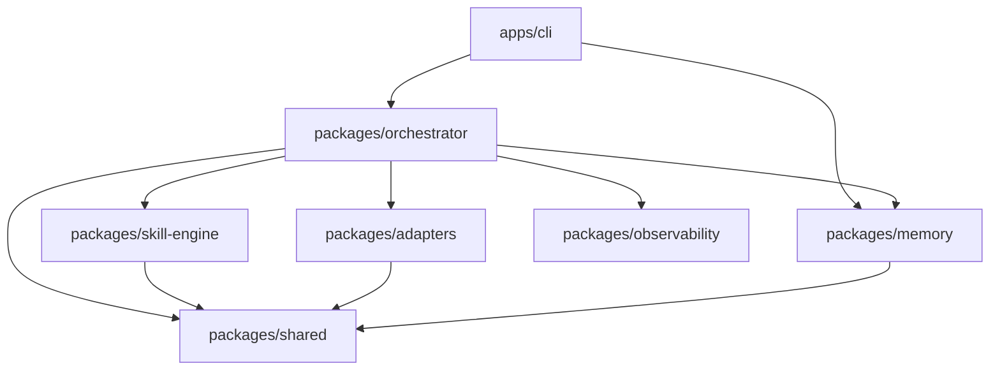

# System Architecture Document: Code-Kit-Ultra

## 1. Monorepo Overview
Code-Kit-Ultra is structured as a TypeScript monorepo with explicit package separation to ensure high modularity and clean dependency boundaries.

## 2. Component Diagram

## 3. Core Packages
- **`@code-kit/orchestrator`**: The central controller managing the intake -> planning -> gate -> execution loop.
- **`@code-kit/shared`**: Definitive source for unified types (Mode, Task, RunReport, etc.) and contract interfaces (PlatformAdapter, SkillDefinition).
- **`@code-kit/memory`**: Persistent local storage engine for system-level memory and run artifacts.
- **`@code-kit/skill-engine`**: Registry-backed scoring engine for selecting or generating implementation skills.
- **`@code-kit/adapters`**: Strategic routing layer recommending AI interfaces (Cursor, Antigravity, etc.).
- **`@code-kit/observability`**: Structured JSON logging and system health diagnostics.

## 4. Run State Lifecycle
1. **Intake**: Normalize idea, infer project type, surface assumptions/questions.
2. **Planning**: Generate task dependency graph from project type.
3. **Skill Selection**: Score registry skills against idea/plan text.
4. **Gate Evaluation**: Automated review across 5 dimensions (Clarity, Completeness, Plan, Skill, Risk).
5. **Memory Recording**: Persist the `RunReport` and update `project-memory.json`.
6. **Adapter Recommendation**: Recommend the best AI execution surface for the phase.

## 5. Technology Stack
- **Language**: TypeScript 5.6+
- **Runtime**: Node.js 22+ (ESM)
- **CLI Framework**: Commander.js
- **Validation**: Zod (Skill Engine)
- **Logging**: Structured JSON (newline-delimited)
- **Styling**: Chalk/Standard output formatting for CLI
