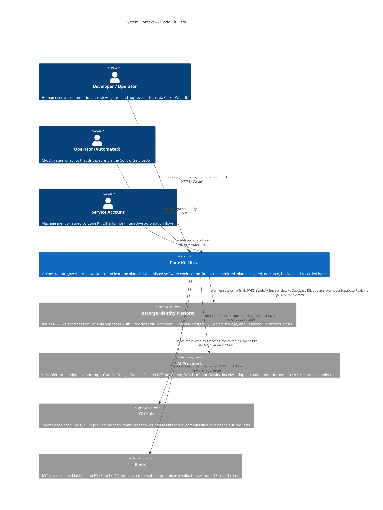
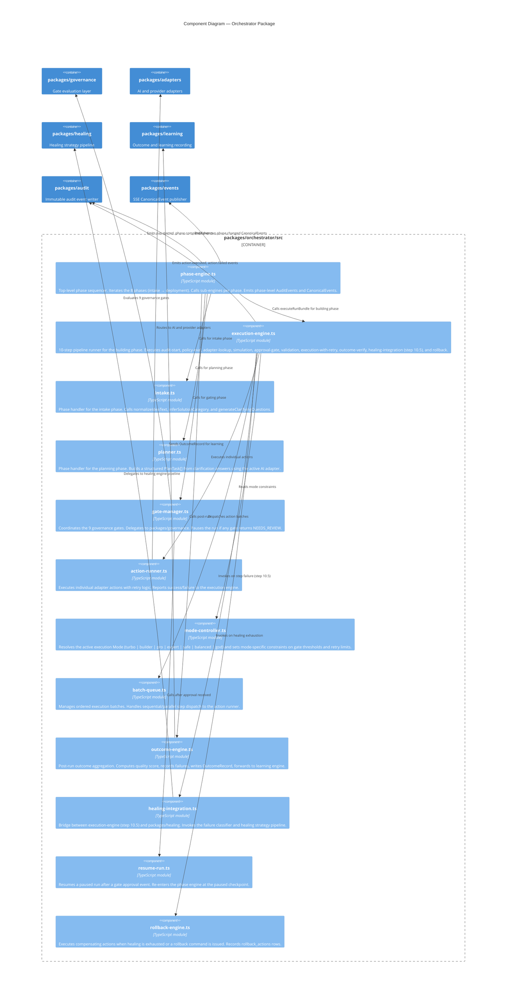
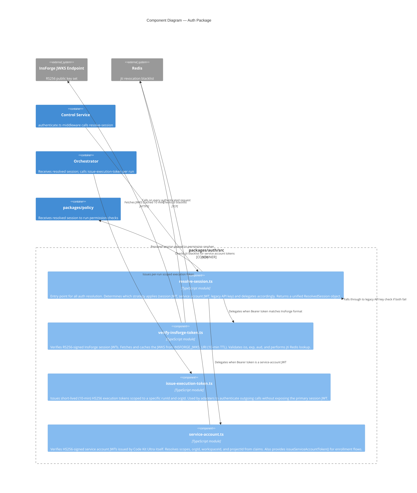

# C4 System Diagrams — Code Kit Ultra

**Status:** Authoritative
**Version:** 1.2.0
**Last reviewed:** 2026-04-04
**See also:** `docs/02_architecture/SYSTEM_ARCHITECTURE.md`, `docs/02_architecture/AUTH_ARCHITECTURE.md`

---

## Overview

This document presents the Code Kit Ultra architecture at three levels of abstraction following the [C4 model](https://c4model.com/):

- **Level 1 — System Context:** Code Kit Ultra in relation to users and external systems.
- **Level 2 — Container Diagram:** The deployable units (apps, packages) and their responsibilities.
- **Level 3 — Component Diagrams:** Internal component breakdown for the Orchestrator and Auth containers.

All diagrams use [Mermaid](https://mermaid.js.org/) syntax and are renderable in GitHub, GitLab, and most modern documentation tooling.

---

## Level 1 — System Context



### System Context Notes

| Actor / System | Role |
|---|---|
| Developer / Operator | Primary human interface. Uses `apps/cli` or `apps/web-control-plane`. |
| Service Account | Machine-to-machine identity. JWT issued by `packages/auth/src/service-account.ts`. |
| InsForge | Identity plane. Code Kit Ultra does **not** own human identity. |
| AI Providers | Stateless inference backends. All routing is done by `packages/adapters`. |
| GitHub | Target environment for code-producing runs. |
| Redis | Fast revocation store. System falls back to in-memory cache if Redis is unavailable. |

---

## Level 2 — Container Diagram

```mermaid
C4Container
  title Container Diagram — Code Kit Ultra

  Person(developer, "Developer / Operator")

  System_Boundary(cku, "Code Kit Ultra") {

    Container(cli, "CLI", "Node.js / TypeScript", "Interactive terminal interface. Issues commands (run, approve, rollback, validate). Located at apps/cli/.")
    Container(webUI, "Web Control Plane", "React + Vite / TypeScript", "Browser-based dashboard. Displays run status, gate decisions, audit trail, and live SSE stream. Located at apps/web-control-plane/.")
    Container(controlService, "Control Service", "Node.js / Express / TypeScript", "Single HTTP API server. Handles auth middleware, command routing, SSE event stream, and realtime bridging. Located at apps/control-service/.")

    Container(orchestrator, "Orchestrator", "TypeScript (internal package)", "Drives the full run lifecycle. Contains: phase-engine, execution-engine, intake, planner, gate-manager, action-runner, mode-controller, batch-queue, outcome-engine, healing-integration, resume-run, rollback-engine.")
    Container(governance, "Governance", "TypeScript (internal package)", "Evaluates the 9 governance gates. Contains: gate-controller, governed-pipeline, confidence-engine, consensus-engine, validation-engine, constraint-engine, intent-engine, adaptive-consensus, kill-switch.")
    Container(adapters, "Adapters", "TypeScript (internal package)", "AI routing adapters (claude, gemini, openai, cursor, windsurf, antigravity) and provider adapters (FileSystem, Terminal, GitHub). Translates internal action contracts to vendor APIs.")
    Container(auth, "Auth", "TypeScript (internal package)", "Verifies InsForge session JWTs, resolves session context, issues per-run execution tokens, and manages service accounts.")
    Container(healing, "Healing", "TypeScript (internal package)", "Post-failure recovery. Classifies failures, selects healing strategies, executes recovery actions, and revalidates outcomes.")
    Container(learning, "Learning", "TypeScript (internal package)", "Post-run intelligence. Persists outcome records, updates reliability scores, tunes execution policies, and surfaces execution optimisations.")
    Container(audit, "Audit", "TypeScript (internal package)", "Writes immutable AuditEvents to the DB with SHA256 hash chain for tamper detection.")
    Container(events, "Events", "TypeScript (internal package)", "Publishes CanonicalEvents to the SSE stream and Supabase Realtime channel using domain.noun.verb naming convention.")
    Container(observability, "Observability", "TypeScript (internal package)", "Structured trace engine, timeline builder, logger, report renderer, and score explainer for run introspection.")
    Container(security, "Security", "TypeScript (internal package)", "Action policy enforcement, batch signing, and batch provenance tracking.")
    Container(policy, "Policy", "TypeScript (internal package)", "RBAC permission resolution, role mapping, and permission constants.")
    Container(skillEngine, "Skill Engine", "TypeScript (internal package)", "Selects skills for a run plan, resolves manifests, and validates skill schemas.")
    Container(commandEngine, "Command Engine", "TypeScript (internal package)", "17 command handlers (execute, approve-batch, rollback, validate, etc.) that translate API routes into orchestrator calls.")
    Container(memory, "Memory", "TypeScript (internal package)", "Run state persistence (run-store.ts) used as the authoritative in-process run record.")
    Container(shared, "Shared", "TypeScript (internal package)", "Cross-package type definitions: types.ts, contracts.ts, governance-types.ts, observability-types.ts.")
  }

  System_Ext(insforge, "InsForge Platform", "Supabase Auth JWKS + PostgreSQL + Realtime")
  System_Ext(aiProviders, "AI Providers", "Claude / Gemini / OpenAI / Cursor / Windsurf / AntiGravity")
  System_Ext(github, "GitHub")
  System_Ext(redis, "Redis")

  Rel(developer, cli, "Runs commands", "stdin / stdout")
  Rel(developer, webUI, "Views dashboard, approves gates", "HTTPS browser")
  Rel(cli, controlService, "Issues API requests", "HTTPS REST + SSE")
  Rel(webUI, controlService, "Issues API requests, consumes SSE", "HTTPS REST + SSE")

  Rel(controlService, auth, "Resolves session on every request", "in-process import")
  Rel(controlService, commandEngine, "Dispatches to command handlers", "in-process import")
  Rel(commandEngine, orchestrator, "Starts / resumes / rolls back runs", "in-process import")
  Rel(orchestrator, governance, "Evaluates gates during gating phase", "in-process import")
  Rel(orchestrator, adapters, "Executes adapter actions during building phase", "in-process import")
  Rel(orchestrator, healing, "Triggers healing on step failure", "in-process import")
  Rel(orchestrator, skillEngine, "Selects skills during skills phase", "in-process import")
  Rel(orchestrator, audit, "Emits AuditEvents at each lifecycle boundary", "in-process import")
  Rel(orchestrator, events, "Publishes CanonicalEvents for SSE", "in-process import")
  Rel(orchestrator, learning, "Records outcomes post-run", "in-process import")
  Rel(orchestrator, security, "Validates action policy and signs batches", "in-process import")
  Rel(orchestrator, memory, "Reads/writes run state", "in-process import")
  Rel(orchestrator, observability, "Traces phases and steps", "in-process import")
  Rel(adapters, aiProviders, "Routes inference requests", "HTTPS / vendor SDK")
  Rel(adapters, github, "Executes GitHub actions", "HTTPS / GitHub REST API")
  Rel(auth, insforge, "Fetches JWKS, validates JWTs", "HTTPS")
  Rel(auth, redis, "Checks jti revocation blacklist", "TCP")
  Rel(events, insforge, "Publishes to Supabase Realtime channel", "WebSocket")

  UpdateLayoutConfig($c4ShapeInRow="4", $c4BoundaryInRow="2")
```



### Container Technology Summary

| Container | Runtime | Key Technology | Notes |
|---|---|---|---|
| CLI (`apps/cli`) | Node.js | TypeScript, commander or similar | No business logic — translates commands to API calls |
| Web Control Plane (`apps/web-control-plane`) | Browser | React, Vite, TypeScript | Consumes SSE for live updates |
| Control Service (`apps/control-service`) | Node.js | Express, TypeScript | Sole HTTP ingress point |
| Orchestrator | Node.js (in-process) | TypeScript | Stateful phase/step runner |
| Governance | Node.js (in-process) | TypeScript | 9-gate evaluation pipeline |
| Adapters | Node.js (in-process) | TypeScript, vendor SDKs | 6 AI + 3 provider adapters |
| Auth | Node.js (in-process) | TypeScript, jose (JWKS/JWT) | Three-strategy auth chain |
| Healing | Node.js (in-process) | TypeScript | Strategy-registry pattern |
| Learning | Node.js (in-process) | TypeScript | Post-run outcome processing |
| Audit | Node.js (in-process) | TypeScript, crypto (SHA256) | Append-only hash chain |
| Events | Node.js (in-process) | TypeScript, SSE | domain.noun.verb naming |

### Container Boundary Rules

The following call directions are **permitted**:

```
Control Service  → Auth, Command Engine
Command Engine   → Orchestrator
Orchestrator     → Governance, Adapters, Healing, Skill Engine, Audit,
                   Events, Learning, Security, Memory, Observability
Adapters         → AI Providers (external), GitHub (external)
Auth             → InsForge JWKS (external), Redis (external)
Events           → InsForge Realtime (external)
```

The following calls are **prohibited** to maintain layering integrity:

- `Adapters → Orchestrator` (adapters are leaves)
- `Governance → Orchestrator` (governance is a pure evaluator)
- `Audit → Orchestrator` (audit is append-only)
- `CLI / Web UI → Orchestrator` (must route through Control Service)

---

## Level 3 — Orchestrator Components



### Orchestrator Phase-to-Component Mapping

| Phase | Primary Component | Secondary Components |
|---|---|---|
| `intake` | `intake.ts` | `phaseEngine`, `audit`, `events` |
| `planning` | `planner.ts` | `phaseEngine`, AI adapter |
| `skills` | `skill-engine selector` | `phaseEngine` |
| `gating` | `gate-manager.ts` | `governance` (all 9 gates) |
| `building` | `execution-engine.ts` | `batchQueue`, `actionRunner`, `adapters` |
| `testing` | `phaseEngine` (simulated) | `audit`, `events` |
| `reviewing` | `phaseEngine` (simulated) | `audit`, `events` |
| `deployment` | `phaseEngine` (simulated) | `audit`, `events` |
| Recovery | `healing-integration.ts` | `healing`, `rollback-engine.ts` |
| Post-run | `outcome-engine.ts` | `learning` |

---

## Level 3 — Auth Components



### Auth Strategy Resolution Order

```
Request arrives at Control Service
       │
       ▼
  Extract Bearer token from Authorization header
       │
       ├── token.iss === INSFORGE_ISSUER?
       │         └── YES → verify-insforge-token.ts
       │                    ├── Fetch/cache JWKS
       │                    ├── Verify RS256 signature
       │                    ├── Validate iss / exp / aud
       │                    ├── Redis jti revocation check
       │                    └── Build ResolvedSession { authMode: 'session' }
       │
       ├── token has `svc:` prefix in sub or known service-account issuer?
       │         └── YES → service-account.ts
       │                    ├── Verify HS256 with SERVICE_ACCOUNT_JWT_SECRET
       │                    ├── Validate exp, scopes
       │                    ├── Redis jti revocation check
       │                    └── Build ResolvedSession { authMode: 'service-account' }
       │
       └── Legacy API key header (X-Api-Key)?
                 └── YES → legacy key lookup in DB
                            └── Build ResolvedSession { authMode: 'legacy-api-key' }
                                ⚠ DEPRECATED — planned for removal
```

### Execution Token Lifecycle

```
Orchestrator starts a new run
       │
       ▼
issue-execution-token.ts
  sign({ sub: actorId, runId, orgId, scope: 'run:execute' }, HS256, exp: +10min)
       │
       ▼
Token stored in run context (not persisted to DB)
       │
       ▼
Adapters use token for outgoing calls to AI providers
       │
       ▼
Token expires automatically after 10 minutes
(No explicit revocation path — expiry is the revocation mechanism)
```

---

## Cross-Cutting Architecture Notes

### Deployment Topology

```
┌─────────────────────────────────────────────────────┐
│                  Single Node.js Process              │
│  apps/control-service                                │
│    ├── Express HTTP server (port configurable)       │
│    ├── SSE endpoint: GET /v1/events                  │
│    ├── All packages imported in-process              │
│    └── No inter-service network calls (monolith)     │
└──────────────────────┬──────────────────────────────┘
                       │ external calls only
            ┌──────────┼──────────────┐
            ▼          ▼              ▼
         InsForge    Redis       AI Providers
       (Supabase)               (Claude, etc.)
```

All packages (`packages/*`) are compiled TypeScript imported directly into the control service process. There are no separate microservices. This is an intentional **modular monolith** design that minimises operational complexity while keeping internal boundaries enforced through module imports rather than network contracts.

### Key Design Invariants

1. **Identity plane separation:** Code Kit Ultra never issues or stores human passwords or primary identity. All human auth is delegated to InsForge.
2. **Governance immutability:** AuditEvents are never updated or deleted. Gate decisions are permanent records.
3. **Adapter isolation:** AI providers are never called directly from orchestrator, governance, or auth. All calls route through `packages/adapters`.
4. **CLI/UI are surfaces only:** `apps/cli` and `apps/web-control-plane` contain no business logic. All logic lives in packages imported by `apps/control-service`.
5. **Execution tokens are ephemeral:** Short-lived HS256 tokens (10 min) prevent long-lived credential leakage to adapters.
