# Entity-Relationship Diagram — Code Kit Ultra

**Status:** Authoritative
**Version:** 1.2.0
**Last reviewed:** 2026-04-04
**See also:** `docs/02_architecture/DATA_MODEL.md`, `/db/schema.sql`, `packages/shared/src/types.ts`

---

## Overview

The Code Kit Ultra database schema is hosted in **Supabase (PostgreSQL)** as part of the InsForge plane. The central entity is a **Run** — every other table exists to scope, govern, observe, or recover runs.

The schema reflects three architectural concerns:

1. **Multi-tenancy:** `organizations → workspaces → projects → runs` form a strict ownership hierarchy. Every row is scoped to at least an `organization_id`.
2. **Governance traceability:** `run_gates`, `run_events`, and `audit_logs` record every decision, event, and action taken during a run's lifecycle. These are append-only.
3. **Operational recovery:** `healing_actions` and `rollback_actions` provide full forensic traceability for automated recovery operations.

> **Table naming note:** The canonical spec names used in this document map to the following repo table names:
> `gate_decisions` → `run_gates` (run_approvals in older migrations),
> `audit_events` → `audit_logs`,
> `canonical_events` → `run_events`.
> See `DATA_MODEL.md §Schema Alignment` for the rename migration reference.

---

## Entity-Relationship Diagram

```mermaid
erDiagram

    %% ─────────────────────────────────────────────
    %% TENANT HIERARCHY
    %% ─────────────────────────────────────────────

    organizations {
        uuid   id             PK
        text   name           "NOT NULL"
        timestamptz created_at "NOT NULL DEFAULT now()"
    }

    workspaces {
        uuid   id              PK
        uuid   organization_id FK
        text   name            "NOT NULL"
        timestamptz created_at "NOT NULL DEFAULT now()"
    }

    projects {
        uuid   id            PK
        uuid   workspace_id  FK
        text   name          "NOT NULL"
        text   slug          "NOT NULL, UNIQUE per workspace"
        timestamptz created_at "NOT NULL DEFAULT now()"
    }

    %% ─────────────────────────────────────────────
    %% IDENTITY & MEMBERSHIP
    %% ─────────────────────────────────────────────

    users {
        text   id            PK  "actorId — sourced from InsForge sub claim"
        text   email         "NOT NULL"
        text   display_name
        timestamptz created_at "NOT NULL DEFAULT now()"
    }

    organization_memberships {
        uuid   id              PK
        uuid   organization_id FK
        text   user_id         FK
        text   role            "owner | admin | member | viewer"
        timestamptz created_at "NOT NULL DEFAULT now()"
    }

    project_memberships {
        uuid   id         PK
        uuid   project_id FK
        text   user_id    FK
        text   role       "owner | admin | member | viewer"
        timestamptz created_at "NOT NULL DEFAULT now()"
    }

    service_accounts {
        text   id             PK  "svc_<slug>"
        text   name           "NOT NULL"
        uuid   org_id         FK
        uuid   workspace_id   FK  "nullable — org-level if null"
        uuid   project_id     FK  "nullable — workspace-level if null"
        jsonb  scopes         "NOT NULL DEFAULT '[]'"
        text   created_by     "actorId of creator"
        timestamptz created_at "NOT NULL DEFAULT now()"
    }

    %% ─────────────────────────────────────────────
    %% RBAC
    %% ─────────────────────────────────────────────

    permissions {
        uuid   id          PK
        text   name        "e.g. run:create, gate:approve, rollback:trigger"
        text   description
    }

    role_permissions {
        uuid   id            PK
        text   role          "FK-equivalent to role column on memberships"
        uuid   permission_id FK
    }

    %% ─────────────────────────────────────────────
    %% RUN CORE
    %% ─────────────────────────────────────────────

    runs {
        uuid   id              PK  "run_YYYYMMDD_NNNN format"
        uuid   organization_id FK
        uuid   workspace_id    FK  "nullable"
        uuid   project_id      FK  "nullable"
        text   actor_id        "actorId — human or service account"
        text   actor_type      "human | service-account | system"
        text   auth_mode       "session | service-account | legacy-api-key"
        text   correlation_id  "NOT NULL — ties audit trail together"
        text   idea            "NOT NULL — raw operator intent"
        text   mode            "turbo | builder | pro | expert | safe | balanced | god"
        text   status          "planned | running | paused | completed | failed | cancelled"
        text   priority        "speed | quality | cost"
        text   deliverable     "app | api | script | report"
        timestamptz created_at "NOT NULL DEFAULT now()"
        timestamptz updated_at "NOT NULL DEFAULT now()"
    }

    plan_tasks {
        uuid   id              PK
        uuid   run_id          FK
        text   phase           "intake | planning | skills | gating | building | testing | reviewing | deployment"
        text   title           "NOT NULL"
        text   description     "NOT NULL"
        text   done_definition "NOT NULL — revalidation target"
        text   status          "pending | running | success | failed | paused | skipped | rolled-back"
        int    position        "NOT NULL — ordering within run"
    }

    %% ─────────────────────────────────────────────
    %% GOVERNANCE
    %% ─────────────────────────────────────────────

    run_gates {
        uuid   id           PK
        uuid   run_id       FK
        text   gate_type    "risk_threshold | policy_compliance | confidence_score | kill_switch | consensus | constraint | validation | intent_alignment | approval"
        text   status       "pending | pass | needs-review | blocked | approved | rejected"
        text   reason       "NOT NULL — human-readable evaluation result"
        bool   should_pause "NOT NULL DEFAULT false"
        text   decided_by   "actorId of approver/rejecter (nullable)"
        timestamptz decided_at   "nullable — set on approval/rejection"
        text   decision_note "optional operator note on decision"
    }

    %% ─────────────────────────────────────────────
    %% EVENTS & AUDIT
    %% ─────────────────────────────────────────────

    run_events {
        uuid   id            PK
        uuid   run_id        FK  "nullable — org-level events have no run"
        text   event_name    "NOT NULL — domain.noun.verb e.g. run.phase.completed"
        jsonb  payload       "NOT NULL"
        text   actor_id
        text   actor_type
        uuid   org_id        FK
        uuid   workspace_id  FK  "nullable"
        uuid   project_id    FK  "nullable"
        text   auth_mode
        text   correlation_id
        timestamptz created_at "NOT NULL DEFAULT now()"
    }

    audit_logs {
        uuid   id            PK
        uuid   run_id        FK  "nullable"
        uuid   organization_id FK
        uuid   workspace_id  FK  "nullable"
        uuid   project_id    FK  "nullable"
        text   actor_id      "NOT NULL"
        text   actor_type    "NOT NULL — human | service-account | system"
        text   auth_mode     "NOT NULL"
        text   correlation_id "NOT NULL"
        text   event_type    "NOT NULL — e.g. run.created, gate.approved"
        jsonb  payload       "NOT NULL"
        text   previous_hash "SHA256 of prior event content + prior hash"
        timestamptz created_at "NOT NULL DEFAULT now()"
    }

    outcome_records {
        uuid    id             PK
        uuid    run_id         FK
        bool    success        "NOT NULL"
        jsonb   failures       "NOT NULL DEFAULT '[]'"
        int     retry_count    "NOT NULL DEFAULT 0"
        int     duration_ms    "NOT NULL"
        numeric quality_score  "0.0000 – 1.0000 (nullable)"
        text    user_feedback  "nullable — operator-provided text"
        int     operator_rating "1–5 CHECK constraint (nullable)"
        timestamptz created_at "NOT NULL DEFAULT now()"
    }

    %% ─────────────────────────────────────────────
    %% RECOVERY
    %% ─────────────────────────────────────────────

    healing_actions {
        uuid   id           PK
        uuid   run_id       FK
        text   step_id      "plan_tasks.id reference (text for flexibility)"
        text   strategy     "retry-same | fallback-adapter | prompt-revision | partial-replan | add-context | escalate-mode"
        int    attempt      "NOT NULL — attempt number within this healing episode"
        text   status       "pending | running | success | failed | exhausted"
        jsonb  input        "Action input passed to healing engine"
        jsonb  output       "Action output / error from healing attempt"
        timestamptz created_at "NOT NULL DEFAULT now()"
        timestamptz updated_at "NOT NULL DEFAULT now()"
    }

    rollback_actions {
        uuid   id           PK
        uuid   run_id       FK
        text   step_id      "plan_tasks.id reference (text for flexibility)"
        text   action_type  "compensating action type"
        text   status       "pending | running | success | failed"
        jsonb  payload      "Compensating action parameters"
        text   triggered_by "actorId or 'system' for automatic rollbacks"
        timestamptz created_at "NOT NULL DEFAULT now()"
        timestamptz updated_at "NOT NULL DEFAULT now()"
    }

    %% ─────────────────────────────────────────────
    %% RELATIONSHIPS
    %% ─────────────────────────────────────────────

    organizations       ||--o{ workspaces             : "contains"
    organizations       ||--o{ organization_memberships : "has members"
    organizations       ||--o{ service_accounts        : "owns"
    organizations       ||--o{ runs                    : "scopes"
    organizations       ||--o{ audit_logs              : "scopes"
    organizations       ||--o{ run_events              : "scopes"

    workspaces          ||--o{ projects                : "contains"
    workspaces          ||--o{ service_accounts        : "scoped to (optional)"
    workspaces          ||--o{ runs                    : "scopes (optional)"

    projects            ||--o{ project_memberships     : "has members"
    projects            ||--o{ service_accounts        : "scoped to (optional)"
    projects            ||--o{ runs                    : "scopes (optional)"

    users               ||--o{ organization_memberships : "member of"
    users               ||--o{ project_memberships     : "member of"

    role_permissions    }o--|| permissions             : "grants"

    runs                ||--o{ plan_tasks              : "contains"
    runs                ||--o{ run_gates               : "evaluated by"
    runs                ||--o{ run_events              : "generates"
    runs                ||--o{ audit_logs              : "recorded in"
    runs                ||--o|  outcome_records        : "produces"
    runs                ||--o{ healing_actions         : "attempts"
    runs                ||--o{ rollback_actions        : "reverses with"

    plan_tasks          ||--o{ healing_actions         : "healed via"
    plan_tasks          ||--o{ rollback_actions        : "rolled back via"
```



---

## Commentary

### 1. Tenant Hierarchy and Run Scoping

The schema enforces a strict four-level ownership hierarchy:

```
organizations
  └── workspaces          (organization_id FK → organizations.id)
        └── projects      (workspace_id FK → workspaces.id)
              └── runs    (organization_id FK required; workspace_id + project_id optional)
```

Every `run` row carries `organization_id` as a **required** foreign key, making org-level tenancy the mandatory scoping unit. `workspace_id` and `project_id` are optional — a run may be scoped as narrowly as a specific project or as broadly as an entire organization.

This design supports three run contexts:

| Context | organization_id | workspace_id | project_id |
|---|---|---|---|
| Org-level run | Required | NULL | NULL |
| Workspace-level run | Required | Required | NULL |
| Project-level run | Required | Required | Required |

The `runs` table's `correlation_id` column is set at request ingress (sourced from the InsForge JWT `jti` or generated) and is threaded through every subsequent `audit_logs` and `run_events` row for the run. This makes it possible to reconstruct the complete causal chain of a run from any event by filtering on `correlation_id`.

---

### 2. RBAC Through Memberships and Role Permissions

Access control is a two-table lookup:

```
users → organization_memberships.role
              │
              └── role_permissions.role
                        │
                        └── permissions.name
                                 (e.g. 'run:create', 'gate:approve', 'rollback:trigger')
```

`organization_memberships` and `project_memberships` record a `role` text column (values: `owner`, `admin`, `member`, `viewer`). The `role_permissions` table maps each role to a set of `permissions` rows. Permission resolution at runtime uses `packages/policy/src/resolve-permissions.ts`, which joins these tables and returns a `PermissionSet` object attached to `req.auth`.

**Key design points:**

- Project memberships override organization memberships — a user can have `viewer` at the org level but `admin` at a specific project.
- Service accounts carry an explicit `scopes` JSONB array (e.g., `["run:create", "gate:read"]`) that bypasses the membership table entirely. Their permissions are evaluated directly from the JWT claims by `service-account.ts`.
- The `permissions` table is the canonical enumeration of every grantable capability in the system. Changes to what a role can do require a migration that updates `role_permissions` rows.

---

### 3. Run Lineage — runs → run_gates → run_events

The traceability chain for any run is:

```
runs (1)
  ├── run_gates (0..*) — one per governance gate evaluated
  ├── run_events (0..*) — one per CanonicalEvent emitted
  ├── plan_tasks (0..*) — one per planned step
  └── outcome_records (0..1) — exactly one post-run summary
```

**`run_gates`** is the authoritative record of every governance decision. It captures:
- `gate_type` — which of the 9 gates was evaluated.
- `status` — the final status after any human decisions.
- `should_pause` — whether this evaluation caused a run pause.
- `decided_by` / `decided_at` / `decision_note` — human approval/rejection attribution.

Because `should_pause` and `status` are set at evaluation time and then updated only on approval/rejection, the full decision history (initial evaluation + subsequent human action) is captured in a single row. This differs from an event-sourced model where two rows would be written. A full event log is still available via `audit_logs` for forensic reconstruction.

**`run_events`** holds all `CanonicalEvents` (the SSE stream persisted to DB). These use the `domain.noun.verb` naming convention (e.g., `run.phase.completed`, `gate.approval.required`). They are optimised for timeline rendering and are indexed on `(run_id, created_at ASC)` to support ordered replay. Unlike `audit_logs`, `run_events` rows may be queried and filtered by `event_name` without decoding JSONB.

**`plan_tasks`** maps 1:N to both `healing_actions` and `rollback_actions`, allowing post-run analysis of which specific steps required recovery and what strategies were attempted.

---

### 4. Audit Integrity — SHA256 Hash Chain in `audit_logs`

The `audit_logs` table provides governance-grade immutability through a **SHA256 hash chain**, implemented in `packages/audit/src/write-audit-event.ts`:

```
┌─────────────────────────────────────────────────────────┐
│  audit_logs row N-1                                      │
│  previous_hash: <hash of row N-2>                        │
│  this_hash:     sha256(content_N-1 + previous_hash_N-1) │
└─────────────────────────────────────────────────────────┘
                      │
                      │ previous_hash_N = this_hash_N-1
                      ▼
┌─────────────────────────────────────────────────────────┐
│  audit_logs row N                                        │
│  previous_hash: <hash of row N-1>                        │
│  this_hash:     sha256(content_N + previous_hash_N)     │
└─────────────────────────────────────────────────────────┘
```

The genesis event uses `previous_hash = '0'.repeat(64)`.

Any tampering with a historical row will invalidate all subsequent `previous_hash` values in the chain, making tampering detectable by a chain verification scan. The hash covers the full event content (`id`, `event_type`, `payload`, `actor_id`, `created_at`) plus the prior hash.

**Known limitation:** The `lastHash` state is held in module-level memory in the current implementation. On process restart, the last hash must be loaded from the DB before writing new events, and multi-replica deployments require a DB-level advisory lock or sequence to prevent chain forks. This is tracked as risk R-09 in `docs/04_tracking/risk-log.md`.

**Immutability guarantees:**
- No `UPDATE` or `DELETE` paths exist in `write-audit-event.ts`.
- The `audit_logs` table has no application-level soft-delete column.
- Row-level security in Supabase should be configured to deny `UPDATE`/`DELETE` for the application role.

---

### 5. Healing and Rollback Traceability

Two tables capture operational recovery events:

**`healing_actions`** records every attempt by `packages/healing/src/healing-engine.ts` to recover a failed step:

- One row per attempt (not per episode) — `attempt` column distinguishes retries within a single episode.
- `strategy` identifies which `HealingStrategy` from `healing-strategy-registry.ts` was applied.
- `status` progresses: `pending → running → success | failed | exhausted`.
- `input` / `output` JSONB columns store the full action parameters and result for forensic replay.

**`rollback_actions`** records compensating actions executed by `rollback-engine.ts` when healing is exhausted or a manual rollback command is issued:

- One row per compensating action (one per completed `plan_tasks` step, executed in reverse order).
- `triggered_by` distinguishes automatic rollback (`'system'`) from operator-initiated rollback (actorId).
- `status` tracks whether each individual compensating action succeeded.

Together, these tables allow a post-incident investigator to reconstruct the exact sequence: which step failed, what healing was attempted, how many attempts were made, which strategy succeeded or failed, and exactly which compensating actions were executed to restore system state.

**Example forensic query (healing episode for a run):**

```sql
-- Full healing and rollback timeline for run 'run_20260404_0042'
SELECT
    'healing'                AS record_type,
    ha.step_id,
    ha.strategy,
    ha.attempt,
    ha.status,
    ha.created_at
FROM healing_actions ha
WHERE ha.run_id = 'run_20260404_0042'

UNION ALL

SELECT
    'rollback'               AS record_type,
    ra.step_id,
    ra.action_type           AS strategy,
    NULL                     AS attempt,
    ra.status,
    ra.created_at
FROM rollback_actions ra
WHERE ra.run_id = 'run_20260404_0042'

ORDER BY created_at ASC;
```

---

## Key Index Summary

| Index | Purpose |
|---|---|
| `idx_runs_project_status (project_id, status, created_at DESC)` | Dashboard and CLI run-list queries |
| `idx_runs_org (organization_id, created_at DESC)` | Org-level run history |
| `idx_run_gates_run (run_id, status)` | Gate status lookups per run |
| `idx_run_gates_pending (status) WHERE status = 'pending'` | Approval queue queries |
| `idx_audit_logs_org_type (organization_id, event_type, created_at DESC)` | Governance audit queries |
| `idx_audit_logs_correlation (correlation_id)` | Cross-event correlation chain reconstruction |
| `idx_run_events_run (run_id, created_at ASC)` | Ordered timeline rendering for UI |
| `idx_outcome_records_success (success, created_at DESC)` | Learning engine analytics |

---

## Table Ownership Summary

| Table | Owner Package | Written by | Read by |
|---|---|---|---|
| `organizations` | `packages/core` | Control Service (org create) | Auth, Policy |
| `workspaces` | `packages/core` | Control Service | Auth, Policy |
| `projects` | `packages/core` | Control Service | Auth, Policy |
| `users` | `packages/core` | InsForge sync | Auth, Policy |
| `organization_memberships` | `packages/policy` | Control Service | Policy |
| `project_memberships` | `packages/policy` | Control Service | Policy |
| `service_accounts` | `packages/auth` | `service-account.ts` | Auth |
| `permissions` | `packages/policy` | Migrations only | Policy |
| `role_permissions` | `packages/policy` | Migrations only | Policy |
| `runs` | `packages/memory` | `run-store.ts` | Orchestrator, Command Engine |
| `plan_tasks` | `packages/memory` | `run-store.ts` | Orchestrator, Planner |
| `run_gates` | `packages/governance` | `gate-manager.ts` | Gate handlers, Approval API |
| `run_events` | `packages/events` | `publish-event.ts` | Realtime, Observability |
| `audit_logs` | `packages/audit` | `write-audit-event.ts` | Audit API, Compliance |
| `outcome_records` | `packages/learning` | `outcome-engine.ts` | Learning Engine |
| `healing_actions` | `packages/healing` | `healing-engine.ts` | Observability, Audit |
| `rollback_actions` | `packages/orchestrator` | `rollback-engine.ts` | Observability, Audit |
