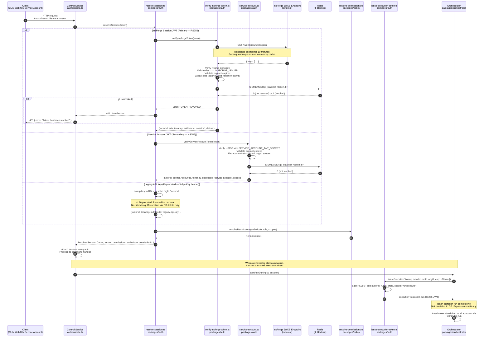
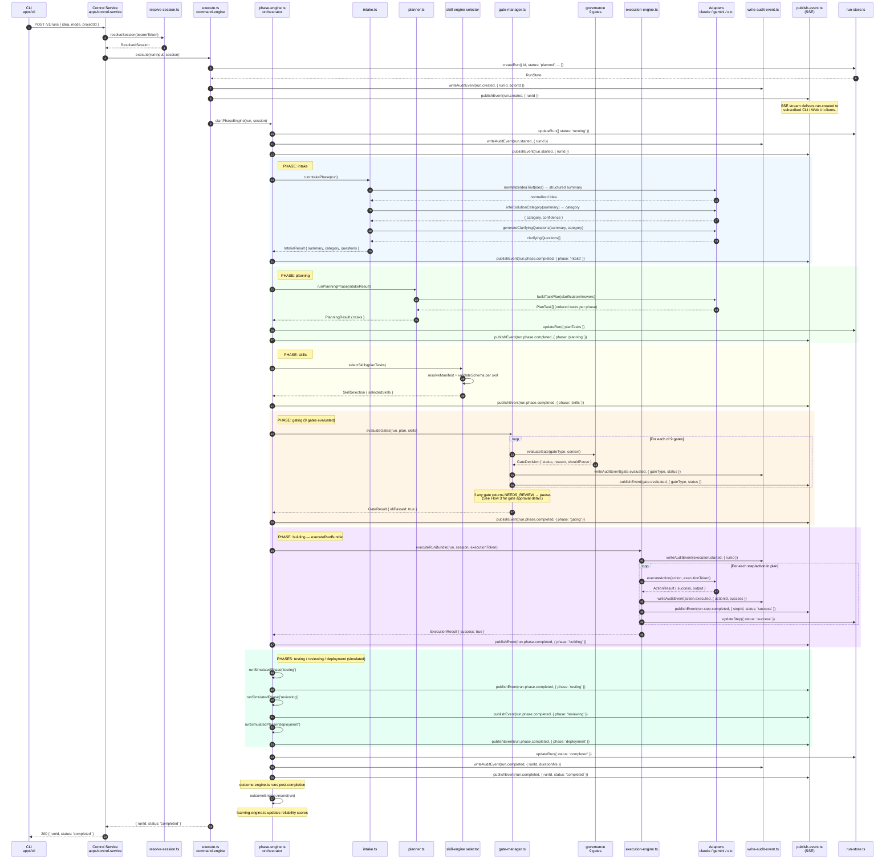
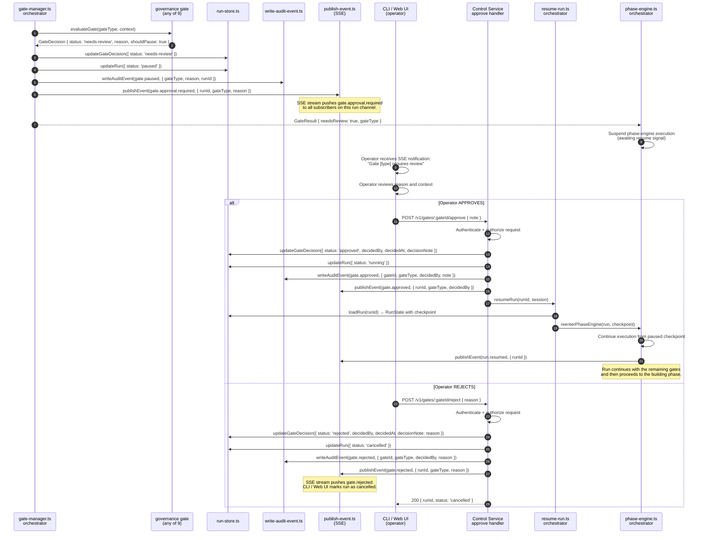
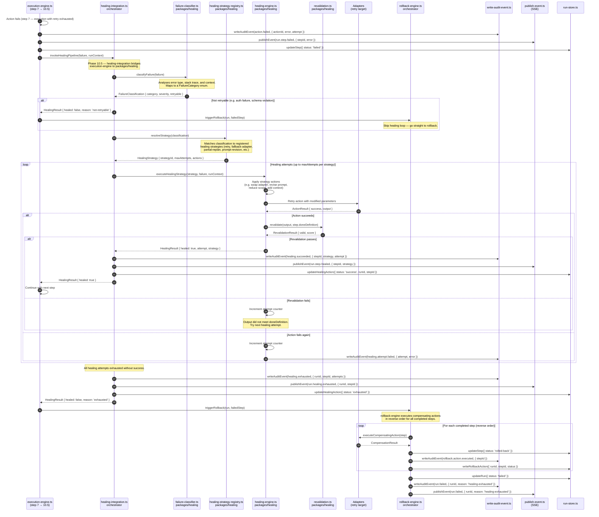

# Sequence Diagrams — Code Kit Ultra

**Status:** Authoritative
**Version:** 1.2.0
**Last reviewed:** 2026-04-04
**See also:** `docs/02_architecture/AUTH_ARCHITECTURE.md`, `docs/02_architecture/SYSTEM_ARCHITECTURE.md`, `docs/02_architecture/C4_SYSTEM_DIAGRAM.md`

---

## Overview

This document provides detailed sequence diagrams for the four most critical flows in Code Kit Ultra:

1. **Auth & Session Resolution** — how every authenticated request is verified.
2. **Run Lifecycle (Happy Path)** — the end-to-end flow from CLI submission to run completion.
3. **Gate Approval Flow** — how a gate pause is raised, reviewed, and resolved.
4. **Healing Loop (Phase 10.5)** — how step failures are classified, healed, or rolled back.

All diagrams use [Mermaid `sequenceDiagram`](https://mermaid.js.org/syntax/sequenceDiagram.html) syntax.

---

## Flow 1 — Auth & Session Resolution

This flow executes on **every authenticated API request**. The `authenticate.ts` middleware in `apps/control-service` is the entry point. It delegates to `packages/auth/src/resolve-session.ts`, which fans out to the appropriate strategy module.



### Auth Notes

| Aspect | Detail |
|---|---|
| JWKS Cache TTL | 10 minutes (in-memory). First request per instance fetches from InsForge. |
| jti Revocation | Redis `SISMEMBER` on `jti_blacklist` set. Falls back to in-memory set if Redis unavailable. |
| Execution Token | HS256, 10-min expiry, scoped to `{ runId, orgId, scope: 'run:execute' }`. Never persisted. |
| Legacy Key | Deprecated. No jti — revocation requires DB row deletion. Removed in a future release. |
| Auth Failure | Returns HTTP 401 with structured `{ error, code }` body. No partial session built. |

---

## Flow 2 — Run Lifecycle (Happy Path)

This flow covers the full end-to-end journey of a run from CLI submission through all 8 phases to completion. The "happy path" assumes all gates pass and no step failures occur.



### Run Lifecycle Notes

| Phase | Handler | AI Call | Gate Check |
|---|---|---|---|
| `intake` | `intake.ts` | Yes (normalize, categorize, questions) | No |
| `planning` | `planner.ts` | Yes (task plan) | No |
| `skills` | `skill-engine/selector.ts` | No | No |
| `gating` | `gate-manager.ts` | Depends on gate type | Yes (9 gates) |
| `building` | `execution-engine.ts` | Yes (via adapters) | Yes (approval gate, step 5) |
| `testing` | `phase-engine.ts` | No (simulated) | No |
| `reviewing` | `phase-engine.ts` | No (simulated) | No |
| `deployment` | `phase-engine.ts` | No (simulated) | No |

---

## Flow 3 — Gate Approval Flow

This flow covers the case where a governance gate returns `NEEDS_REVIEW`, pausing the run until a human operator approves or rejects via the API. The flow branches on approval vs. rejection.



### Gate Type Reference

The 9 governance gates evaluated during the `gating` phase, in evaluation order:

| # | Gate Type | Evaluator | Pause Trigger |
|---|---|---|---|
| 1 | Risk Threshold Gate | `gate-controller.ts` | Risk score exceeds mode threshold |
| 2 | Policy Compliance Gate | `governed-pipeline.ts` + `constraint-engine.ts` | Policy violation detected |
| 3 | Confidence Score Gate | `confidence-engine.ts` | Score below mode minimum |
| 4 | Kill Switch Gate | `kill-switch.ts` | Kill switch active for org/workspace |
| 5 | Consensus Gate | `consensus-engine.ts` + `adaptive-consensus.ts` | Consensus not reached across adapters |
| 6 | Constraint Gate | `constraint-engine.ts` | Hard constraint violated |
| 7 | Validation Gate | `validation-engine.ts` | Output fails validation schema |
| 8 | Intent Alignment Gate | `intent-engine.ts` | Plan intent diverges from idea |
| 9 | Approval Gate | `gate-controller.ts` | Mode requires explicit human approval |

### GateStatus Transitions

```
pending → pass          (gate evaluated and passed — run continues)
pending → needs-review  (gate requires human decision — run paused)
pending → blocked       (gate hard-blocked — run fails immediately)
needs-review → approved (human approved — run resumes)
needs-review → rejected (human rejected — run cancelled)
```

---

## Flow 4 — Healing Loop (Phase 10.5)

This flow executes within `execution-engine.ts` at step 10.5 — between a step failure (step 7) and the final rollback decision (step 10). It is triggered automatically whenever an action returns a failure result.



### Healing Strategy Types

| Strategy | Trigger Condition | Action |
|---|---|---|
| `retry-same` | Transient network/timeout error | Retry identical action with exponential backoff |
| `fallback-adapter` | AI provider error or low-confidence output | Switch to next AI adapter in priority order |
| `prompt-revision` | Output failed validation but adapter responded | Revise prompt with additional constraints |
| `partial-replan` | Step scope too large for single action | Decompose step into smaller sub-actions |
| `add-context` | Insufficient context in original action | Inject additional context from run memory |
| `escalate-mode` | Low confidence across all adapters | Temporarily elevate execution mode |

### Healing Loop Limits

| Mode | Max Healing Attempts per Step |
|---|---|
| `turbo` | 1 |
| `builder` | 2 |
| `pro` | 3 |
| `expert` | 3 |
| `safe` | 5 |
| `balanced` | 3 |
| `god` | 5 |

When `maxAttempts` is exhausted, the healing integration returns `{ healed: false }` and `execution-engine.ts` immediately invokes `rollback-engine.ts`.

### Audit Events in Healing

| Event Type | When Emitted |
|---|---|
| `action.failed` | Initial step failure (execution-engine, step 7) |
| `healing.attempt.started` | Each healing attempt begins |
| `healing.attempt.failed` | A healing attempt produces failure |
| `healing.succeeded` | Healing attempt produces passing revalidation |
| `healing.exhausted` | All attempts used without success |
| `rollback.action.executed` | Each compensating action runs |
| `run.failed` | Run status transitions to `failed` after rollback |
