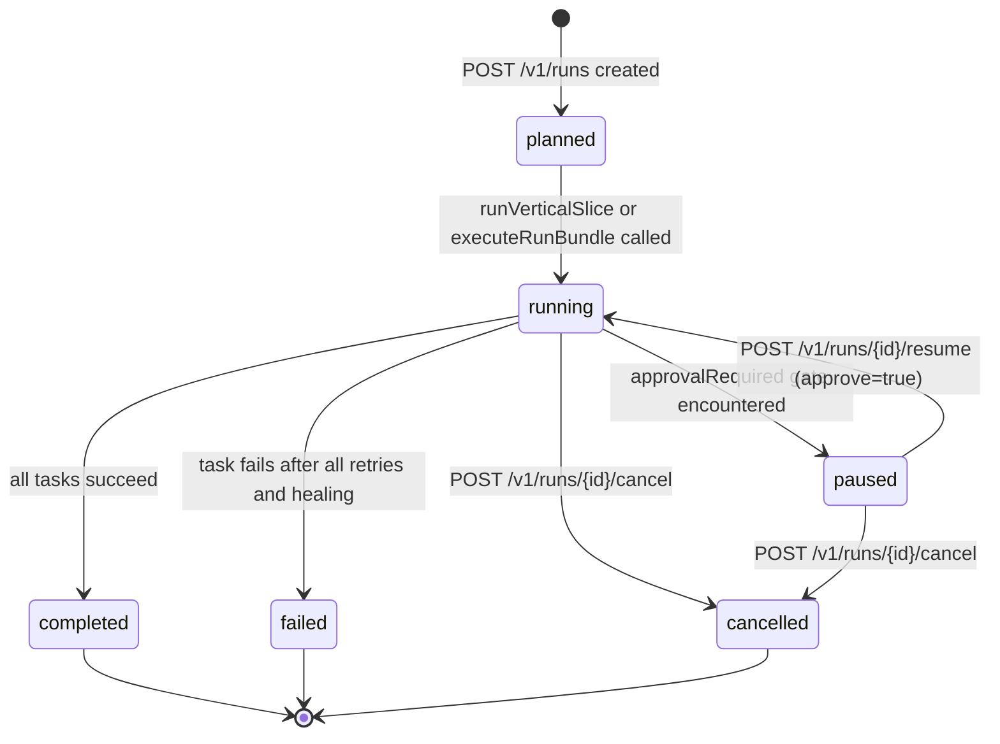

# SPEC — Run Lifecycle State Machine
**Status:** Draft
**Version:** 1.0
**Linked to:** docs/02_architecture/ARCHITECTURE.md
**Implements:** Complete state machine for RunStatus, StepStatus, and GateStatus across all phases of execution

---

## Objective

Define the canonical state machine governing the lifecycle of a Run in Code-Kit-Ultra. This spec establishes every valid state, every legal transition, the trigger that causes each transition, the side effects that must occur (events emitted, DB writes, tokens issued), and the invariants that must hold at all times. All runtime components — orchestrator, execution engine, gate manager, and API layer — must conform to this machine.

---

## Scope

- `RunStatus` state machine (top-level run lifecycle)
- `StepStatus` state machine (per-task execution within a run)
- `GateStatus` state machine (per-gate evaluation result)
- Phase-to-status mapping
- API endpoints that drive state transitions
- Error states and recovery paths
- Invariants and consistency rules

Out of scope: individual adapter behavior, billing lifecycle, authentication flows.

---

## Inputs / Outputs

| Direction | Item | Type | Description |
|-----------|------|------|-------------|
| Input | Run creation request | `RunVerticalSliceInput` | idea, mode, dryRun, approvedGates |
| Input | Resume request | runId + approve flag | Triggers paused → running transition |
| Input | Gate approval | gateId, actorId | Satisfies a `needs-review` gate |
| Input | Cancel request | runId, actorId | Triggers running/paused → cancelled |
| Output | `RunBundle` | Persistent bundle in run-store | Full snapshot of run state at any point |
| Output | Audit events | `writeAuditEvent` calls | Append-only audit log per transition |
| Output | Orchestrator events | `publishEvent` via events.ts | Scoped to orgId + workspaceId |

---

## Data Structures

```typescript
// Defined in packages/shared/src/types.ts
type RunStatus = "planned" | "running" | "paused" | "completed" | "failed" | "cancelled";
type StepStatus = "pending" | "running" | "success" | "failed" | "paused" | "skipped" | "rolled-back";
type GateStatus = "pass" | "fail" | "needs-review" | "blocked" | "pending";

interface RunState {
  runId: string;
  createdAt: string;
  updatedAt: string;
  currentStepIndex: number;
  status: RunStatus;
  approvalRequired: boolean;
  approved: boolean;
  pauseReason?: string;
  orgId?: string;
  workspaceId?: string;
  projectId?: string;
  actorId?: string;
  actorType?: ActorType;
  correlationId?: string;
}

interface StepExecutionLog {
  stepId: string;
  title: string;
  adapter: string;
  attempt: number;
  status: StepStatus;
  startedAt: string;
  finishedAt?: string;
  output?: string;
  error?: string;
  rollbackAvailable: boolean;
  risk?: ExecutionRisk;
  simulationSummary?: string;
  verificationStatus?: "passed" | "failed";
  verificationSummary?: string;
  fixSuggestion?: string;
}
```

---

## Interfaces / APIs

### API Endpoints That Trigger Transitions

| Endpoint | Transition | Required Role |
|----------|-----------|---------------|
| `POST /v1/runs` | `planned → running` | operator, admin |
| `POST /v1/runs/{id}/resume` | `paused → running` | operator, admin |
| `POST /v1/runs/{id}/cancel` | `running/paused → cancelled` | operator, admin |
| `POST /v1/gates/{id}/approve` | gate: `needs-review → pass` | reviewer, admin |
| `POST /v1/gates/{id}/reject` | gate: `needs-review → blocked` | reviewer, admin |

---

## RunStatus State Machine



### Transition Details

| From | To | Trigger | Actions |
|------|----|---------|---------|
| `planned` | `running` | `executeRunBundle` called; `markState(bundle, "running")` | Write `RunState.status = running`, audit `TASK_EXECUTION_ATTEMPT`, emit `execution.started` |
| `running` | `paused` | Task requires approval and `bundle.state.approved === false` | Write `RunState.status = paused`, `approvalRequired = true`, `pauseReason = <reason>`, audit `APPROVAL_REQUIRED`, emit `gate.awaiting_approval` |
| `running` | `completed` | All tasks in `bundle.plan.tasks` complete successfully | Write `RunState.status = completed`, `currentStepIndex = tasks.length`, audit `RUN_COMPLETED`, emit `execution.completed`, call `recordRunOutcome(success=true)` |
| `running` | `failed` | `executeTask` returns `completed: false` after retry exhaustion | Write `RunState.status = failed`, audit `STEP_EXECUTION_FAILED`, emit `execution.failed`, call `recordRunOutcome(success=false)` |
| `running` | `cancelled` | API call to cancel endpoint | Write `RunState.status = cancelled`, audit `RUN_CANCELLED` |
| `paused` | `running` | `resumeRun(runId, approve=true)` called | Write `RunState.approved = true`, `approvalRequired = false`, re-invoke `executeRunBundle` |
| `paused` | `cancelled` | API call to cancel endpoint while paused | Write `RunState.status = cancelled` |

---

## Phase-to-Status Mapping

The phase engine (`phase-engine.ts`) runs phases sequentially. The following table shows which `RunStatus` values are valid at each phase boundary.

| Phase | Entry Status | Exit on Success | Exit on Blocked | Exit on Awaiting-Approval |
|-------|-------------|-----------------|-----------------|--------------------------|
| intake | `in-progress` | `in-progress` | `blocked` | — |
| planning | `in-progress` | `in-progress` | — | — |
| skills | `in-progress` | `in-progress` | — | — |
| gating | `in-progress` | `in-progress` | `blocked` | `awaiting-approval` |
| building | `in-progress` | `in-progress` | — | `awaiting-approval` |
| testing | `in-progress` | `in-progress` | — | — |
| reviewing | `in-progress` | `in-progress` | — | — |
| deployment | `in-progress` | `success` | — | — |

Note: `runOrchestrationStep` maps phase handler `status` to `RunReport.status` as follows:
- handler `"success"` + `nextPhase != null` → report status `"in-progress"`
- handler `"success"` + `nextPhase === null` → report status `"success"`, `isFinished = true`
- handler `"blocked"` → report status `"blocked"`
- handler `"awaiting-approval"` → report status `"awaiting-approval"`

---

## StepStatus State Machine

```mermaid
stateDiagram-v2
    [*] --> pending : task created in plan

    pending --> running : executeTask begins attempt
    running --> success : adapter.execute succeeds and verification passes
    running --> failed : adapter.execute throws after all retries
    running --> paused : requiresApproval=true and bundle.state.approved=false
    running --> rolled-back : healing fails and rollbackPayload present
    failed --> rolled-back : automatic rollback via adapter.rollback
    paused --> running : resumeRun(approve=true) restarts from currentStepIndex
    success --> [*]
    rolled-back --> [*]
    failed --> [*]
```

### StepStatus Transition Details

| From | To | Trigger |
|------|----|---------|
| `pending` | `running` | `executeTask` invoked for task at `currentStepIndex` |
| `running` | `success` | `adapter.execute` returns `{ success: true }` and `adapter.verify` returns `{ ok: true }` |
| `running` | `failed` | Error thrown on final retry attempt; healing does not produce `"verified"` status |
| `running` | `paused` | `requiresApproval === true` and `bundle.state.approved === false` |
| `running` | `rolled-back` | Execution fails; `task.rollbackPayload` exists; `adapter.rollback(task.rollbackPayload)` called |
| `paused` | `running` | `resumeRun` sets `approved = true`, re-enters task loop at saved `currentStepIndex` |
| `failed` | `rolled-back` | Automatic rollback path in `executeTask` after retry exhaustion |

---

## GateStatus State Machine

```mermaid
stateDiagram-v2
    [*] --> pending : gate registered

    pending --> pass : evaluateGates returns pass
    pending --> needs-review : evaluateGates returns needs-review
    pending --> blocked : evaluateGates returns blocked

    needs-review --> pass : POST /v1/gates/{id}/approve (manual approval)
    needs-review --> blocked : POST /v1/gates/{id}/reject
    needs-review --> pass : mode=turbo auto-pass applied

    pass --> [*]
    blocked --> [*]
```

### Gate Resolution Priority

`getOverallGateStatus` applies the following precedence across all 5 gate decisions:
1. If any gate is `"blocked"` → overall is `"blocked"` (run cannot proceed)
2. If any gate is `"needs-review"` → overall is `"needs-review"` (run pauses for human)
3. If all gates are `"pass"` → overall is `"pass"` (run advances to building phase)

Manual approvals are tracked in `RunReport.approvedGates: string[]`. Any gate whose ID appears in that array is force-set to `"pass"` regardless of evaluation result.

---

## Invariants

The following rules must hold at all times across the system:

1. **Terminal states are final.** A run with status `completed`, `failed`, or `cancelled` must never transition to another status without an explicit retry mechanism creating a new run.
2. **`currentStepIndex` monotonicity.** `RunState.currentStepIndex` only decreases during explicit `rollbackTask` calls; it never decreases automatically during forward execution.
3. **`approved` resets after each step.** Upon successful step completion, `bundle.state.approved` is reset to `false` to prevent approval bleed to subsequent steps.
4. **Audit events are append-only.** `writeAuditEvent` is never called to overwrite or delete prior events.
5. **Events require tenant scope.** `emitOrchestratorEvent` silently skips emission if `orgId` or `workspaceId` is missing from `RunState`, preventing orphan events.
6. **Gate approval list is cumulative.** `approvedGates` only grows during a run; approved gates are never un-approved during a single run lifecycle.
7. **Paused run state is persisted before returning.** `markState(bundle, "paused", {...})` calls `updateRunState` before the function returns, ensuring the checkpoint is durable.

---

## Error States and Recovery Paths

### Policy Block (`POLICY_BLOCK`)
- **Cause:** `evaluatePolicy(task)` returns `allowed: false`
- **State written:** `RunStatus = failed`, `StepStatus = failed`
- **Recovery:** Fix the policy rule or request an exemption; no automatic recovery

### Adapter Not Found (`ADAPTER_NOT_FOUND`)
- **Cause:** `findAdapter(adapters, task.adapterId)` returns null
- **State written:** `RunStatus = failed`, `StepStatus = failed`
- **Recovery:** Register the missing adapter in the adapter registry; then call `retryTask`

### Validation Failure (`VALIDATION_FAILED`)
- **Cause:** `adapter.validate(task.payload)` returns `false`
- **State written:** `RunStatus = failed`, audit includes `fixSuggestion` if adapter provides one
- **Recovery:** Use `fixSuggestion` to correct payload; call `retryTask`

### Execution Failure with Healing
- **Cause:** `adapter.execute` throws on final retry attempt
- **Path:** `healFailedStep` invoked → if `status === "verified"`, `maxAttempts` incremented and execution resumes; if `approvalRequired`, run pauses; otherwise run fails
- **State written:** `RunStatus = failed` if healing cannot recover
- **Recovery:** Call `retryTask(runId, stepId)` after fixing root cause

### Resume After Approval
- **Cause:** Run is `paused` due to `requiresApproval`
- **Path:** `POST /v1/runs/{id}/resume` → `resumeRun(runId, approve=true)` → `bundle.state.approved = true` → `executeRunBundle` resumes from `currentStepIndex`
- **Side effect:** `approved` resets to `false` after the approved step completes

---

## Dependencies

| Dependency | Package | Purpose |
|-----------|---------|---------|
| `run-store` | `packages/memory` | `loadRunBundle`, `updateRunState`, persist state |
| `execution-engine` | `packages/orchestrator` | `executeRunBundle`, transitions running/paused/completed/failed |
| `gate-manager` | `packages/orchestrator` | `evaluateGates`, GateStatus transitions |
| `events.ts` | `packages/orchestrator` | `emitExecutionStarted/Completed/Failed`, `emitGateAwaitingApproval` |
| `audit` | `packages/audit` | `writeAuditEvent`, append-only audit record |
| `policy-engine` | `packages/core` | `evaluatePolicy`, blocks or allows task execution |

---

## Edge Cases

- **God mode with no tenant scope:** `emitOrchestratorEvent` skips event emission; run still executes but is unobservable via event stream.
- **Expert mode exits after each phase:** `runVerticalSlice` returns after the first `runOrchestrationStep` call in expert mode, requiring the caller to re-invoke for each phase.
- **Turbo mode auto-passes `needs-review` gates:** In `evaluateGates`, any gate returning `needs-review` is rewritten to `pass` when `mode === "turbo"`, bypassing the approval pause.
- **Resume of a completed run:** `resumeRun` checks `bundle.state.status === "completed"` and returns early without re-executing, preventing double-execution.
- **Rollback of step with no rollback payload:** `rollbackTask` throws `"Rollback not available for step: {id}"` — callers must check `StepExecutionLog.rollbackAvailable` before calling.
- **Concurrent approval and cancellation:** No lock is held on `RunState`; last writer wins. API layer must serialize concurrent state mutations per runId.

---

## Risks

| Risk | Likelihood | Impact | Mitigation |
|------|-----------|--------|-----------|
| State desync between memory store and audit log | Medium | High | Wrap `markState` and `writeAuditEvent` in the same call path; do not split them |
| `approved` flag persisting across steps due to resume edge cases | Low | High | Invariant #3 enforced in `executeTask` success path; covered by tests |
| Orphan paused runs (no actor to resume) | Medium | Medium | `gate.awaiting_approval` event must trigger notification; add TTL on paused state |
| Terminal state re-entry via concurrent API calls | Low | High | Idempotency guard needed at API layer before `executeRunBundle` |

---

## Definition of Done

- [ ] All `RunStatus` transitions are covered by integration tests with state assertions
- [ ] All `StepStatus` transitions emit the correct audit event with expected fields
- [ ] Gate approval flow tested end-to-end: `needs-review → approved → run resumes`
- [ ] `resumeRun` with `approve=false` does not re-approve the paused step
- [ ] `rollbackTask` throws a typed error when `rollbackPayload` is absent
- [ ] Turbo mode auto-pass behavior validated against all 5 gates
- [ ] Expert mode single-step behavior validated in `runVerticalSlice`
- [ ] All 5 gate IDs (`objective-clarity`, `requirements-completeness`, `plan-readiness`, `skill-coverage`, `ambiguity-risk`) are reflected in `approvedGates` tracking
- [ ] Terminal state guard tested: completed run re-submitted returns bundle without re-executing
- [ ] Mermaid diagrams in this spec render correctly in the project documentation site
