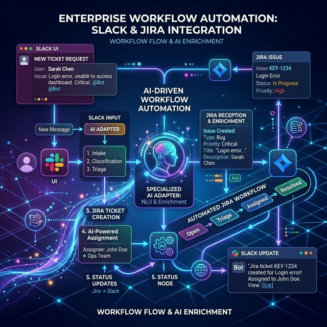

# Case Study: Enterprise Ops Automation (Internal Tooling)

**Problem**: An operations team needs an internal tool to orchestrate approvals across Slack and Jira, but manual coordination is slow and error-prone.



**How Code Kit Ultra Helps**:

- **Multi-Platform Routing**: Uses the `governance-policy.json` to route planning to Antigravity and implementation stubs to specialists.
- **Safety Gates**: Every orchestration step must pass through the Quality and Security gates.
- **Standardized Success**: Generates high-confidence plan reports that can be audited by technical leads.

## 🚀 Try it Yourself

Run the internal tool demo journey:

```bash
npm install
bash scripts/demo-internal-tool.sh
```

## 🎯 Why it Matters

For enterprise teams, Code Kit Ultra provides:

- **Operational Safety**: Built-in gates prevent reckless automation.
- **Traceable Automation**: Every run captures why an adapter was selected and what the outcome was.
- **Platform Agnosticity**: Transition smoothly from mock environments to real platform execution.

---

*Code Kit Ultra: Bringing governance to the autonomous enterprise.*
